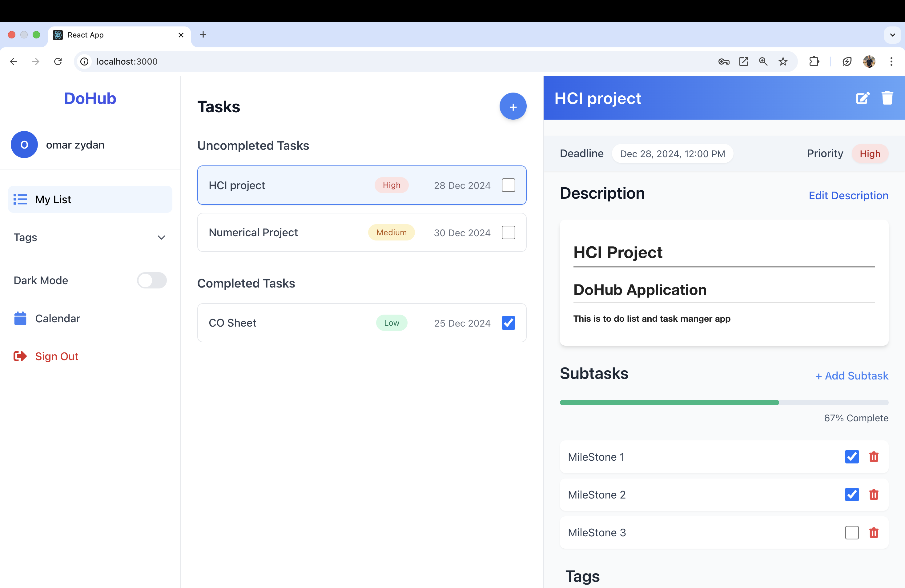
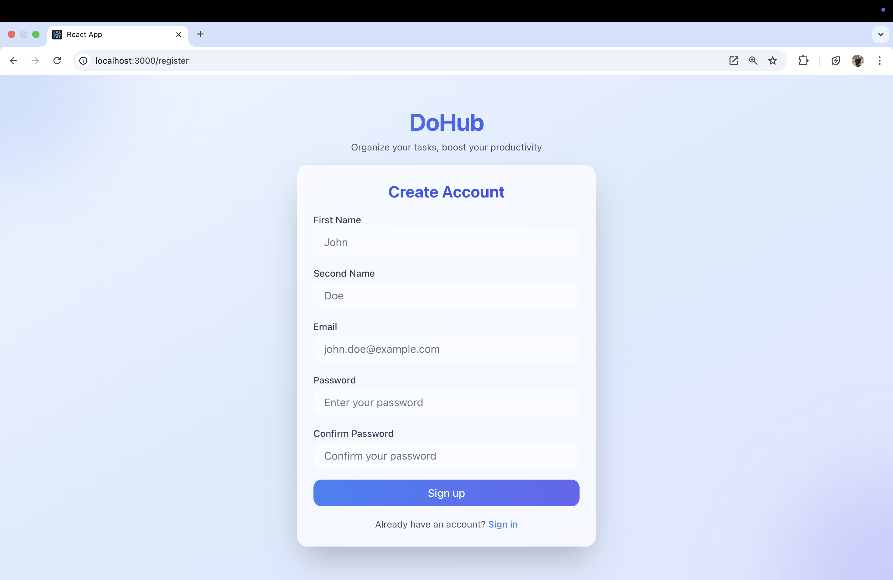
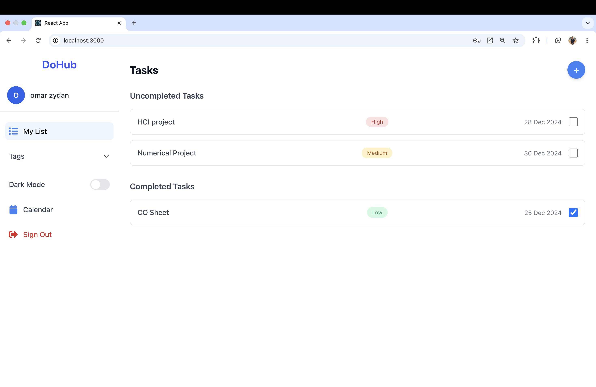
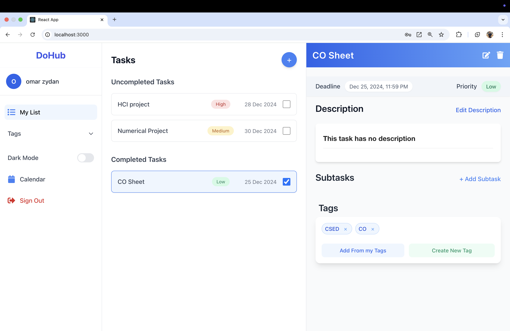
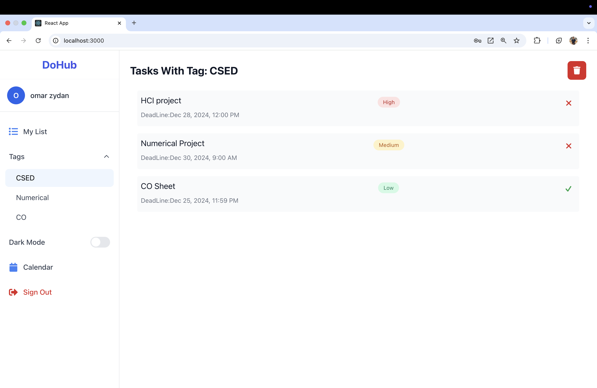
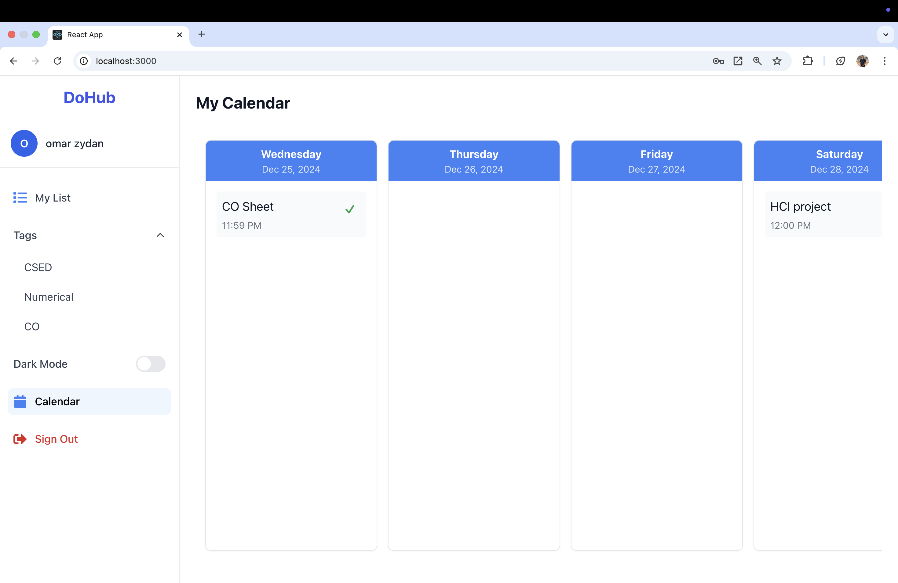
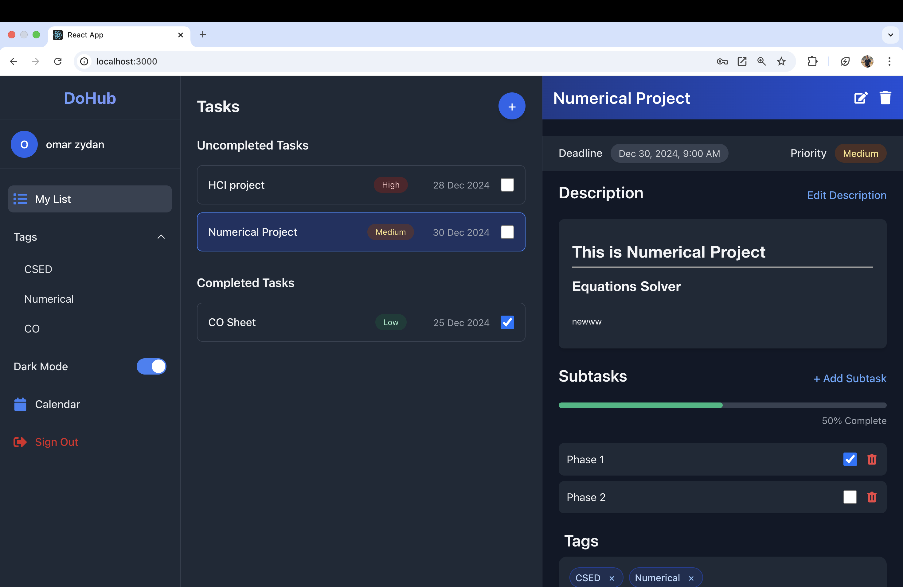

# DoHub

**DoHub** is a feature-rich, web-based to-do list application designed to help you stay organized and productive. Whether you're managing simple tasks or complex projects, DoHub provides the tools you need to prioritize and track your progress efficiently.



## Table of Contents

1. [Features](#features)
2. [Technology Stack](#technology-stack)
3. [Getting Started](#getting-started)
4. [Demo](#demo)
5. [Screenshots](#screenshots)

## [Features](#features)

### Task Management

- **Add, Delete, and Toggle Tasks**: Seamlessly manage your tasks and toggle their status between completed and not completed.
- **Task Details**: Assign descriptions, priorities, and deadlines to each task for better organization.
- **Subtasks**: Create subtasks for your main tasks and track progress with an integrated progress bar.

### Tag System

- **Custom Tags**: Add tags to tasks for categorization.
- **Filter by Tags**: Quickly view tasks associated with specific tags.

### User Accounts

- **Login and Sign-Up**: Securely log in or create an account to synchronize your tasks across devices.

### Security

- **JWT (JSON Web Tokens)**: Used for secure authentication and session management.
- **bcrypt**: Ensures password hashing for enhanced security.

### Dark Mode

- **Light/Dark Themes**: Switch between light and dark modes to suit your preferences.

### Responsiveness

- **Mobile and Desktop Friendly**: Enjoy a seamless experience on any device.

### Collaborative Work

- **Users can add contributers to their tasks and edit them together in real time using SSE**

## [Technology Stack](#technology-stack)

### Frontend

- **React**: For building an interactive and dynamic user interface.
- **Tailwind CSS**: For efficient and responsive styling.

### Backend

- **Node.js**: To handle server-side operations and APIs.
- **MySQL**: For robust and scalable data storage.
-  **JWT**: (JSON Web Tokens): Used for secure authentication and session management.
- **Bcrypt**: Ensures password hashing for enhanced security.
- **SSE**: (Server Send Event): To realtime collaboration

## [Getting Started](#getting-started)

### Prerequisites

- **Node.js**: Ensure you have Node.js installed.
- **MySQL**: A running MySQL instance is required.

### Installation

1. Clone the repository:

   ```bash
   git clone https://github.com/your-username/DoHub.git
   cd DoHub
   ```
2. Install dependencies:

   ```bash
   npm install
   ```
3. Configure the environment:

   - Set up a `.env` file in the backend with the following details:
     ```
     DB_HOST=localhost
     DB_USER=root
     DB_PASSWORD=
     DB_NAME=toDoApp
     ```
4. Run the backend server:

   ```bash
   npm run dev
   ```
5. Start the frontend:

   ```bash
   npm start
   ```
6. Open your browser and navigate to:

   ```
   http://localhost:3000
   ```

## [Demo](#demo)

https://github.com/user-attachments/assets/bc39f705-3ea2-4608-9047-a3cb921a240b

## [Screenshots](#screenshots)

|  |  |
| :--------------------------: | ---------------------------- |
|  |  |
|  |  |
|  |  |
